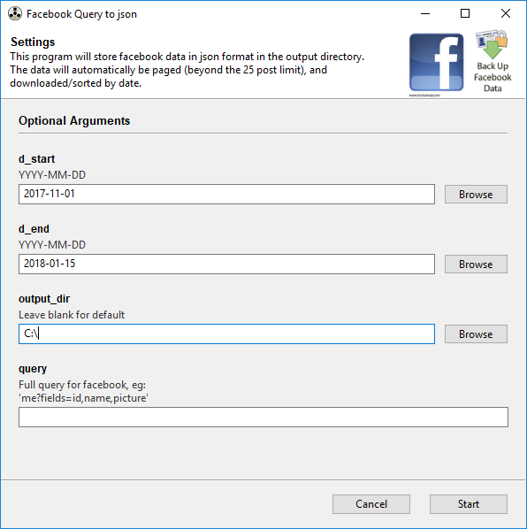

# Facebook Utilites

This project was created to streamline a common task- Taking a *[Facebook Query](https://developers.facebook.com/docs/graph-api/)* 
and downloading the json data between 2 dates.


## Getting Started

These instructions will get you a copy of the project up and running on your local machine for usage and development.

### Prerequisites

FacebookUtilities uses python 3.6

### Installing 

1. Clone the repo

    ```
    git clone https://github.com/datavistics/FacebookUtilities.git
    ```

2. Install the requirements from the folder containing *requirements.txt*
    ```
    pip install -r requirements.txt
    ```

3. Store your token in a json in `src/user_data.json`
    ```json
    {
        "token": "sample_token_value"
    }
    ```

## Usage

1. Run the program

    ```
    cd src
    python download_query.py
    ```

2. Put the relevant data in

    * **FacebookUtilities** will automatically page through multiple posts, comments, reactions, etc. 
    Facebook limits each page to ~25 items. 
    * It will also store all the data in the output directory of your choosing in files named 
    after the date with the format of "YYYY-MM-DD.json"

## Built With

* [Gooey](https://github.com/chriskiehl/Gooey) - CLI -> GUI

## Contributing

Please contact me if you are interested!

## Authors

* **Derek Thomas** - *Original Author and Maintainer*

## License

This project is licensed under the BSD License - see the [LICENSE.md](LICENSE.md) file for details

## Acknowledgements

* [README advice](https://gist.github.com/PurpleBooth/109311bb0361f32d87a2)
